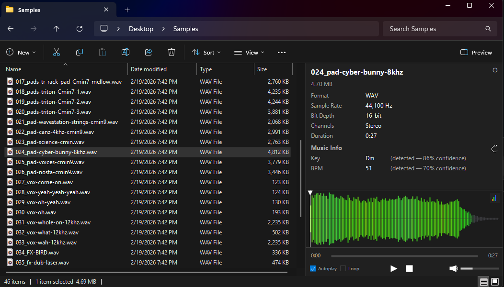

# Audex

**Audio preview for Windows Explorer — the feature Microsoft forgot.**

Windows Explorer has had a built-in preview pane for decades. It handles images, PDFs, text files, Office documents — but audio files? Nothing. Select an MP3 and you get a blank pane. No waveform, no playback, no metadata. You have to open a separate application just to hear a 10-second clip.

Audex fills that gap. Select an audio file in Explorer and immediately see a frequency-colored waveform, play it back with full controls, and read its metadata — all inside the preview pane, without opening anything else.



## What It Does

- **Instant preview** — select any audio file in Explorer and hear it immediately
- **Frequency-colored waveform** — bass (red/warm), mids (green), highs (blue/cyan) — the same color scheme DJs see in Serato and Traktor
- **Full playback controls** — play/pause/stop, volume, mute, seek by clicking the waveform
- **Keyboard shortcuts** — Ctrl+Space (play/pause), Ctrl+Left/Right (seek), Ctrl+Up/Down (volume), and more
- **BPM & key detection** — reads from tags, or analyzes the audio when tags are missing
- **Broad format support** — WAV, MP3, FLAC, AIFF, OGG, AAC, WMA, OPUS, M4A, and tracker formats (MOD, XM, IT, S3M)
- **Settings** — autoplay toggle, loop mode, WASAPI device selection, waveform height presets, and key profile selection (Auto/Krumhansl/Temperley)
- **Dark & light theme** — follows your Windows system theme automatically

## Why This Exists

If you work with audio files — as a DJ, producer, sound designer, podcast editor, or music collector — you've felt this friction. You have a folder of samples, tracks, or recordings. You want to quickly scan through them. But Explorer gives you nothing. So you drag files into a DAW, or open them one by one in a media player, or install a third-party file manager just to get audio preview.

Audex makes Explorer work the way it should have from the start. Select a file, hear it, see its waveform, check the BPM and key — then move on to the next one. No context switching. No extra windows.

## Installation

### Installer (recommended)

Download the latest installer from [Releases](../../releases) and run it. The installer handles:
- .NET Framework 4.8 detection (prompts to install if missing)
- COM registration with Windows Explorer
- File type association (choose which formats to preview)
- Native BASS audio libraries

After installation, open Explorer, enable the preview pane (Alt+P), and select an audio file.

### Manual registration (development)

```powershell
# Build
dotnet build src/Audex/Audex.csproj -c Release -p:Platform=x64

# Register (run as Administrator)
.\scripts\register.ps1

# To unregister
.\scripts\unregister.ps1
```

## Keyboard Shortcuts - When Preview Pane has focus

| Shortcut | Action |
|----------|--------|
| Ctrl+Space | Play / Pause |
| Ctrl+Left | Seek backward (adaptive: 5% of duration) |
| Ctrl+Right | Seek forward |
| Ctrl+Up | Volume up |
| Ctrl+Down | Volume down |
| Ctrl+M | Mute / Unmute |
| Ctrl+L | Toggle loop mode |
| Ctrl+, | Open settings |
| Escape | Close settings overlay |

## Supported Formats

| Category | Formats |
|----------|---------|
| Lossless | WAV, FLAC, AIFF |
| Compressed | MP3, AAC, OGG, OPUS, WMA, M4A |
| Tracker/Module | MOD, XM, IT, S3M |

## Architecture

Audex is a COM shell extension that implements `IPreviewHandler` — the same interface used by Explorer's built-in PDF and image previewers. It runs inside Explorer's `prevhost.exe` host process.

```
Explorer (prevhost.exe)
  └── AudioPreviewHandler (COM IPreviewHandler)
        ├── PreviewWindow (WinForms UserControl, reparented via SetParent)
        │     ├── LayoutRenderer (metadata display, GDI+)
        │     ├── WaveformRenderer (frequency-colored bars, GDI+)
        │     ├── ControlBarRenderer (playback controls, GDI+)
        │     └── SettingsOverlayRenderer (config UI, GDI+)
        ├── AudioPlayer (BASS engine, WASAPI output, BassMix)
        ├── WaveformGenerator (BASS decode → peak extraction + FFT)
        ├── BpmKeyAnalyzer (BASS decode → BPM + tuning-corrected chroma key detection)
        └── TagReader (TagLib# metadata extraction)
```

Key architectural choices:
- **GDI+ rendering** — all UI is painted directly in `OnPaint`. No WPF (crashes prevhost.exe), no WinForms controls beyond the host UserControl
- **Static renderers** — each renderer is stateless; receives data, paints, returns hit rectangles
- **BASS audio engine** — decode streams feed a BassMix mixer for sample rate conversion, output via WASAPI
- **Owner-drawn tooltips** — standard WinForms tooltips don't work in prevhost.exe (no Form ancestry), so tooltips are painted in GDI+

## Building from Source

### Prerequisites

- Visual Studio 2022 or .NET Framework 4.8 SDK
- Windows 10/11 (x64)

### Build

```powershell
dotnet build Audex.sln -c Release -p:Platform=x64
```

### Run Tests

```powershell
dotnet test tests/Audex.Tests/Audex.Tests.csproj
```

## Tech Stack

| Component | Technology |
|-----------|-----------|
| Language | C# / .NET Framework 4.8 |
| UI | WinForms UserControl + GDI+ |
| Audio Engine | [BASS](https://www.un4seen.com/) via [ManagedBass](https://github.com/ManagedBass/ManagedBass) |
| Audio Output | WASAPI (via BassMix for sample rate conversion) |
| Metadata | [TagLib#](https://github.com/mono/taglib-sharp) |
| Key Detection | Tuning-corrected chroma + profile correlation (Auto/Krumhansl/Temperley) |
| BPM Detection | BASS FX library |
| Config | JSON (Newtonsoft.Json) in %LOCALAPPDATA%\Audex |
| Logging | [Serilog](https://serilog.net/) |

## Configuration

Audex stores settings in JSON at `%LOCALAPPDATA%\Audex\config.json`.

Key detection profile can be set in Settings UI (recommended) or directly in config:

```json
{
  "KeyDetectionProfile": "auto"
}
```

Supported values:
- `auto` — evaluates available profiles and picks the strongest match
- `krumhansl` — classic Krumhansl-Schmuckler profile set
- `temperley` — Temperley profile set

## Project Structure

```
Audex/
├── src/Audex/
│   ├── Audio/           # AudioPlayer, WaveformGenerator, BPM/key analysis, plugin management
│   ├── Config/          # JSON config manager (AppData)
│   ├── FileReader/      # Audio header parsers (WAV, MP3, FLAC)
│   ├── Interop/         # COM interfaces (IPreviewHandler, IInitializeWithStream)
│   ├── PreviewHandler/  # COM registration and handler entry point
│   ├── UI/              # GDI+ renderers (layout, waveform, controls, settings)
│   ├── Utils/           # Logger
│   └── native/x64/      # BASS native DLLs
├── tests/Audex.Tests/   # Unit tests
└── scripts/             # Registration and diagnostic scripts
```

## License

BASS audio library requires a [commercial license](https://www.un4seen.com/bass.html#license) for distribution outside of freeware. To compile and run this project please download the following modules from [www.un4seen.com](https://www.un4seen.com/bass.html) and place the x64 dll in src/native/x64.

- BASS_AAC 2.4.7.1
- BASS FX 2.4.12.6
- BASS 2.4.18.3
- BASSFLAC 2.4.5.5
- BASSmix 2.4.12
- BASSOPUS 2.4.3.1
- BASSWASAPI 2.4.4.1
- BASSWMA 2.4.5.13

## Acknowledgments

- [BASS Audio Library](https://www.un4seen.com/) by Un4seen Developments — the audio engine that makes broad format support possible
- [ManagedBass](https://github.com/ManagedBass/ManagedBass) — C# wrapper for BASS
- [TagLib#](https://github.com/mono/taglib-sharp) — metadata reading
- [Serilog](https://serilog.net/) — structured logging
- [Inno Setup](https://jrsoftware.org/isinfo.php) — installer framework
